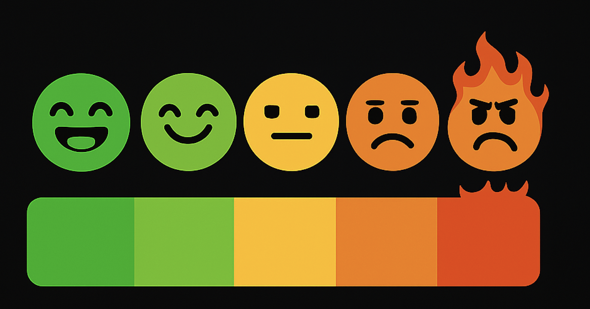

# Kick Mood Meter

A Chrome extension that analyzes chat sentiment on Kick.com livestreams and displays real-time mood data with an interactive on-screen widget.

## Overview

Kick Mood Meter helps streamers and viewers understand the overall sentiment of chat in real-time. The extension analyzes messages in the chat and categorizes them as positive, neutral, or negative, providing valuable insights into the audience's mood during streams.

## Features

- **Live Sentiment Analysis**: Monitors chat messages and performs sentiment analysis in real-time
- **Movable On-Screen Widget**: Displays current chat mood directly on the stream page
- **Mood Visualization**: Shows mood distribution with an intuitive meter and color-coded indicators
- **Detailed Statistics**: Provides percentage breakdowns of positive, neutral, and negative sentiment
- **Customizable Settings**: Adjust widget transparency and update frequency
- **Easy Positioning**: Double-click to enable drag mode and position the widget anywhere on screen

## Installation

1. Download the extension from the Chrome Web Store (link coming soon)
2. Click "Add to Chrome" to install
3. Navigate to any Kick.com channel page
4. The Mood Meter widget will automatically appear on the page

### Manual Installation (Developer Mode)

1. Download or clone this repository
2. Open Chrome and go to `chrome://extensions/`
3. Enable "Developer mode" in the top-right corner
4. Click "Load unpacked" and select the extension directory
5. Navigate to any Kick.com channel page to see the widget in action

## Usage

### Viewing Sentiment Data

- The widget automatically appears on any Kick.com channel page
- The mood meter shows the current sentiment level from positive (left) to negative (right)
- Hover over the widget to see more detailed information

### Widget Controls

- **Show/Hide**: Click the extension icon and use the toggle button to show or hide the widget
- **Positioning**: Double-click the widget to enter drag mode (indicated by a green border), then drag it to your preferred location
- **Exit Drag Mode**: Double-click again or press ESC

### Settings Customization

1. Click the extension icon in your browser toolbar
2. Click the "Settings" button
3. Adjust the following options:
   - **Background Transparency**: Control the opacity of the widget background
   - **Update Frequency**: Set how often the sentiment analysis refreshes (5-60 minutes)
4. Click "Save Settings" to apply your changes

## How It Works

The extension analyzes chat messages using sentiment analysis techniques:

1. **Data Collection**: Collects chat messages from the stream
2. **Sentiment Analysis**: Processes messages using pre-labeled sentiment data
3. **Mood Calculation**: Determines the overall mood based on the distribution of positive, neutral, and negative messages
4. **Visualization**: Updates the widget to reflect the current mood state

## Privacy

- All analysis happens locally in your browser
- No chat data is sent to external servers
- No user data is collected or stored
